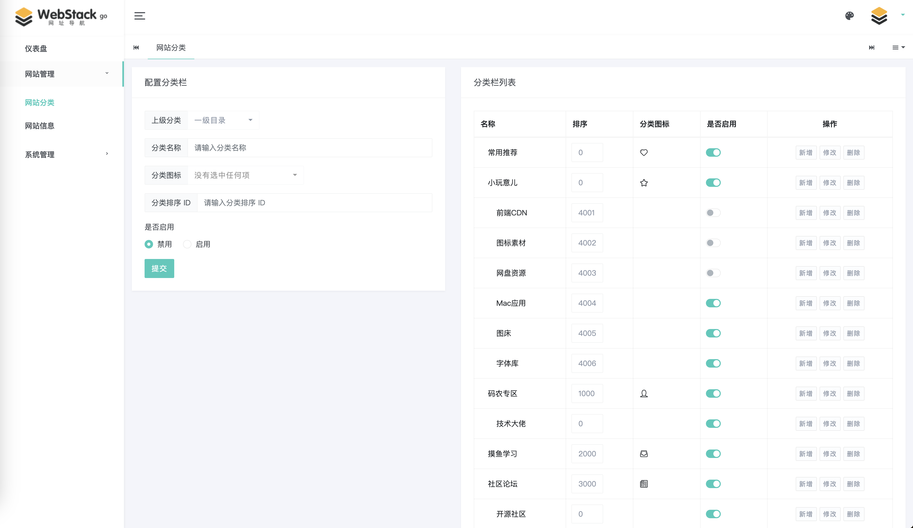
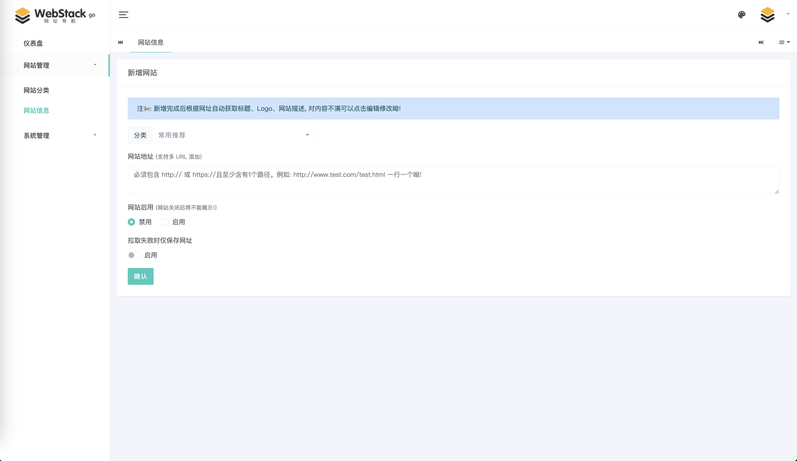
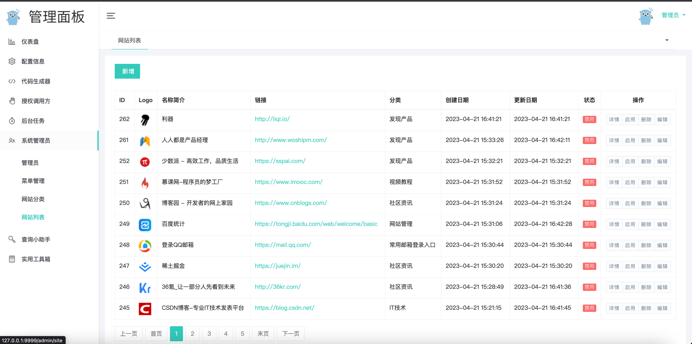

# webstack-go 网址导航后台系统

基于 Golang 开源的网址导航网站项目，具备完整的前后台，您可以拿来制作自己平日收藏的网址导航。
> v1: 使用 mysql 和 redis 组件, 丰富的后端功能。 v2: 简化版无需额外组件, 使用轻量级 sqlite 数据库。

- 前端模板: [WebStackPage](https://github.com/WebStackPage/WebStackPage.github.io)、[光年后台模板](https://gitee.com/yinqi/Light-Year-Admin-Using-Iframe-v4)
- 后端框架: 基于 [go-nunu](https://github.com/go-nunu/nunu) 脚手架搭建

功能：
- [x] 新增 webstack - 导航首页
- [x] 新增 系统管理员 - 网站分类
- [x] 新增 系统管理员 - 网站列表
- [x] 新增 网站新增支持自动获取标题、Logo、网站描述、一键同步
- [x] 新增 批量添加网址
- [x] 新增 由 [gorm-gen](https://github.com/go-gorm/gen) 代码生成提供支持的友好且更安全的 GORM

## 快速开始

### 一、运行环境

- Golang 1.22
- SQLite

### 二、启动服务

> 两种方式运行 1. 源码启动服务 2. Docker启动服务

**一、源码运行服务**

1. 目录下执行 `go mod tidy` 拉取项目依赖库
2. 执行 `go build -o ./bin/server ./cmd/server` 编译项目，生成可执行文件 server 
3. 编译完执行 `./bin/server -conf=config/prod.yml` 首次启动程序之后，会生成 SQLite 数据库，并自动创建表结构


**二、Docker运行服务**


1. 目录下执行 `make docker` 等待启动
   ```shell
   CONTAINER ID   IMAGE            COMMAND      CREATED         STATUS         PORTS                    NAMES
   5cb641ff3950 webstack-go:v2   "./server"   5 seconds ago Up 5 seconds 0.0.0.0:8000->8000/tcp webstack-go
   ```
2. docker container 正常运行后, 在浏览器中打开界面，链接地址：http://127.0.0.1:8000

## Star History

[](https://star-history.com/#ch3nnn/webstack-go&Date)

## 效果图

> **首页**


> **网站分类**



> **新增网站**



> **网站信息**


