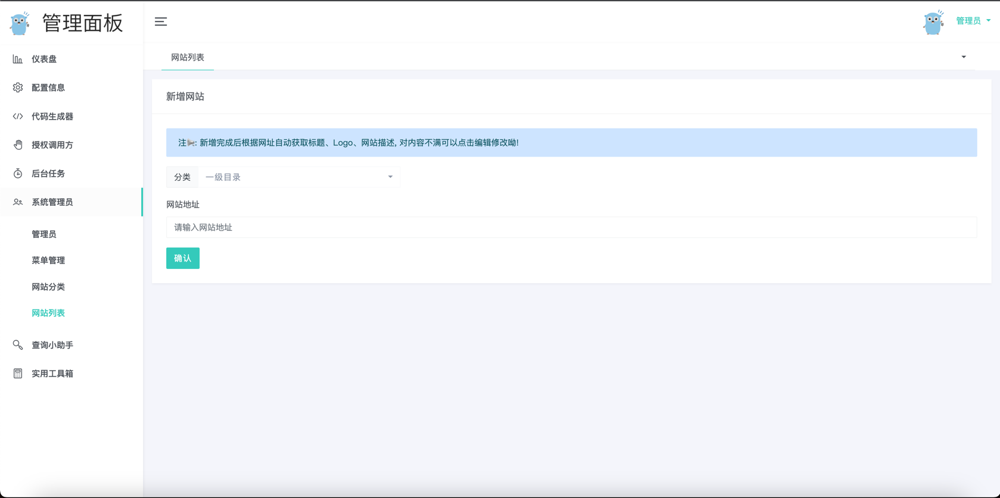

# webstack-go 网址导航后台系统

基于 Golang 开源的网址导航网站项目，具备完整的前后台，您可以拿来制作自己平日收藏的网址导航。

- 图标库: [lineicons](https://lineicons.com/icons/)
- 前端模板: [WebStackPage](https://github.com/WebStackPage/WebStackPage.github.io)
- 后端 Gin 框架: 基于 [go-gin-api ](https://github.com/xinliangnote/go-gin-api)项目二次开发

原有后端项目基础上新增功能：

1. webstack - 导航首页
2. 系统管理员 - 网站分类
3. 系统管理员 - 网站列表
4. 网站新增支持自动获取标题、Logo、网站描述
5. 新增 docker-compose.yml 一键安装各个组件

## 快速开始

### 一、运行环境

> 安装 Golang、Mysql、Redis

- Golang 1.16+ 因为使用了 //go:embed 特性；
- MySQL
    - 连接地址，例如：127.0.0.1:3306；
    - 数据库名，例如：webstack，会在此数据库下初始化数据表；
    - 用户名，不可为空；
    - 密码，不可为空；
- Redis
    - 连接地址，例如：127.0.0.1:6379；
    - 密码，可为空；
    - 连接DB，默认是 0 ；

### 二、启动服务

> 两种方式运行 1. 源码启动服务 2. Docker启动服务

**一、源码运行服务**

1. 目录下执行 `go mod tidy` 拉取项目依赖库
2. 安装完依赖执行 `go run main.go` 首次启动程序之后，会在浏览器中自动打开安装界面，链接地址：http://127.0.0.1:9999/install
3. 点击 `初始化项目` 会看到如下图所示, 如果提示重新运行服务说明项目初始化完成, 只需重新运行服务就 OK 了!

   

**二、Docker运行服务**
> 包含两部分 1. 基础服务(Mysql、Redis、Service) 2. 监控服务(Prometheus、Grafana) 


**一、基础服务**

1. 目录下执行 `docker-compose -f docker-compose.yml up -d` 等待基础组件启动 (Mysql、Redis、Service)
   ```shell
   $ docker-compose -f docker-compose.yml up -d
   [+] Running 4/4
   ✔ Network webstack-go            Created                                                                                                                0.1s
   ✔ Container webstack-go-mysql    Healthy                                                                                                               12.9s
   ✔ Container webstack-go-redis    Healthy                                                                                                               13.4s
   ✔ Container webstack-go-service  Started  
   ```

2. 执行`docker-compose -f docker-compose.yml ps `服务正常运行如下
   ```shell
   NAME                  IMAGE                             COMMAND                  SERVICE               CREATED             STATUS                   PORTS
   webstack-go-mysql     mysql/mysql-server:5.7            "/entrypoint.sh mysq…"   webstack-go-mysql     2 minutes ago       Up 2 minutes (healthy)   0.0.0.0:3306->3306/tcp, 33060/tcp
   webstack-go-redis     redis:6.2.4                       "docker-entrypoint.s…"   webstack-go-redis     2 minutes ago       Up 2 minutes (healthy)   0.0.0.0:6379->6379/tcp
   webstack-go-service   webstack-go-webstack-go-service   "./webstack-go -env …"   webstack-go-service   2 minutes ago       Up 2 minutes (healthy)   0.0.0.0:9999->9999/tcp
   ```
3. docker container 正常运行后, 在浏览器中打开安装界面，链接地址：http://127.0.0.1:9999/install
4. 点击 `初始化项目` 会看到如下图所示, 如果提示重新运行服务说明项目初始化完成, 只需重新运行 `webstack-go-service` 容器服务就 OK 了!
   

**二、prometheus、grafana监控服务**
> 注: 监控服务看自己是否需要, 不运行也不影响正常使用

1. 目录下执行 `docker-compose -f docker-compose-prometheus.yml up -d` 等待监控组件启动 (Prometheus、Grafana)
    ```shell
    [+] Running 4/4
    ✔ Container webstack-go-prometheus  Started                                                                                                             4.0s
    ✔ Container webstack-go-loki        Started                                                                                                             3.6s
    ✔ Container webstack-go-grafana     Started                                                                                                             4.3s
    ✔ Container webstack-go-promtail    Started  
    ```
2. 执行`docker-compose -f docker-compose-prometheus.yml ps `服务正常运行如下
    ```shell
      NAME                     IMAGE                              COMMAND                  SERVICE                  CREATED             STATUS                   PORTS
      webstack-go-grafana      grafana/grafana-enterprise:9.4.3   "/run.sh"                webstack-go-grafana      2 minutes ago       Up 2 minutes             0.0.0.0:3000->3000/tcp
      webstack-go-loki         grafana/loki:2.7.3                 "/usr/bin/loki -conf…"   webstack-go-loki         2 minutes ago       Up 2 minutes             0.0.0.0:3100->3100/tcp
      webstack-go-mysql        mysql/mysql-server:5.7             "/entrypoint.sh mysq…"   webstack-go-mysql        3 minutes ago       Up 3 minutes (healthy)   0.0.0.0:3306->3306/tcp, 33060/tcp
      webstack-go-prometheus   prom/prometheus:latest             "/bin/prometheus --c…"   webstack-go-prometheus   2 minutes ago       Up 2 minutes             0.0.0.0:9090->9090/tcp
      webstack-go-promtail     grafana/promtail:2.7.3             "/usr/bin/promtail -…"   webstack-go-promtail     2 minutes ago       Up 2 minutes             
      webstack-go-redis        redis:6.2.4                        "docker-entrypoint.s…"   webstack-go-redis        3 minutes ago       Up 3 minutes (healthy)   0.0.0.0:6379->6379/tcp
      webstack-go-service      webstack-go-webstack-go-service    "./webstack-go -env …"   webstack-go-service      3 minutes ago       Up 3 minutes (healthy)   0.0.0.0:9999->9999/tcp
    ```

## 效果图

> **首页**


> **网站分类**


> **新增网站**



> **网站信息**


> **监控组件**


